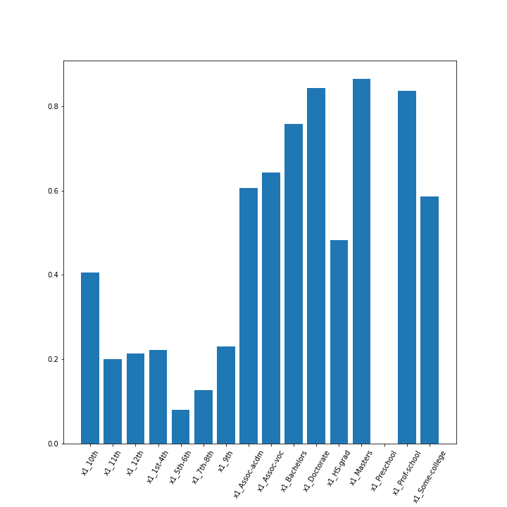

# Model Card

For additional information see the Model Card paper: https://arxiv.org/pdf/1810.03993.pdf

## Model Details

    - Author: Luis Melgar
    - Model date: 2021-11-10
    - Model version: 1.0.0
    - Model Type: Random Forest Classifier
    - Information about training: The Random Forest Classifier has max_depth = 5 and the imbalance has been treated by penalizing errors in the minority class at the level of the loss function.
    
## Intended Use

    - Udacity MLOps Course - module 4.
    - Users: Personal

## Factors

    - A more detailed study should be done to identify relevant factors.
    - One of them could be a group established based on education of individuals

## Training Data

    - Data obtained from https://archive.ics.uci.edu/ml/datasets/census+income
    - The model was trained on 80% of the data with shuffling applied on the rows. 
    - Some pre-process steps have been implemented: Removed spaces in columns and some categorical variables, one-hot encoding for categorical variables and label-encoding for the target.

## Evaluation Data

    - The test (evaluation) set includes the remaining 20% of the data.
    - We applied the same preprocess steps as for the training set 

## Metrics

    - The global metrics found for this dataset with the chosen model are:
        - precision: 0.47830543218312266
        - recall: 0.8832807570977917 
        - f_beta: 0.6205673758865248
    - Decision threshold was probability >= 0.5 for deciding whenever the outcome = 1

## Quantitative Analysis

    We include dissagregated metrics based on education

    
    
    

## Ethical Considerations

    - No ethical issues or intrinsic biases have been considered as this project serves educational purposes only.  

## Caveats and Recommendations

    - One thing to consider are categorical variables that posses large cardinality, as the one hot encoding method is not the best approach in that case. Also, some categories might have very few examples attached to them and it could make sense to combine them with others to create meaningful and larger groups.